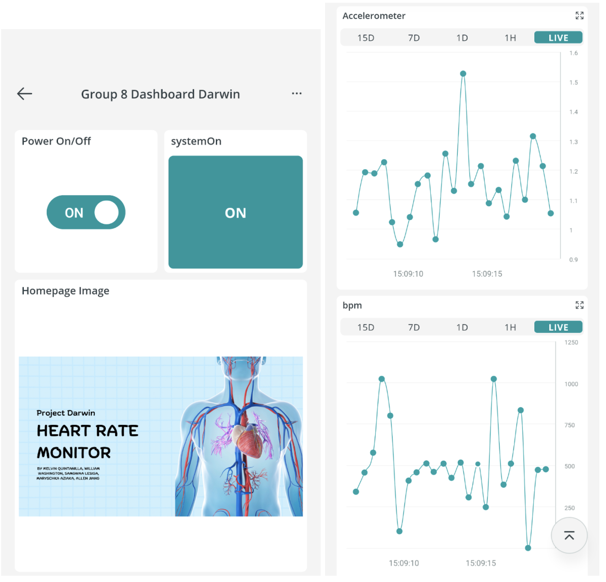

# Darwin: Cloud-Connected IoT Health Monitor

An Arduino-based IoT device that streams real-time heart rate (BPM) and motion (g-force) data to Arduino Cloud for remote monitoring via web and mobile dashboards.

Built for INST347: Cloud Computing for Information Science at the University of Maryland.

---

## What It Does

- Reads pulse data from a finger-mounted sensor and streams BPM to Arduino Cloud
- Tracks motion using the onboard LSM6DS3 IMU/accelerometer and calculates g-force
- Triggers LED and buzzer alerts based on heart rate thresholds
- Displays real-time readings on the Arduino MKR IoT Carrier screen
- Accessible via the Arduino IoT Remote app on mobile and desktop

## Demo Video 
[](https://youtu.be/STu-EwD7wG4)

## Dashboard 


## Use Case

Designed for caffeine-dependent users to monitor how stimulant intake affects heart rate and sleep movement patterns, enabling data-driven awareness of health habits.

## Hardware

- Arduino MKR IoT Carrier
- Pulse Sensor (connected to pin A5)
- Built-in LSM6DS3 IMU (accelerometer/gyroscope)
- Built-in LED ring, buzzer, and TFT display

## Tech Stack

| Component | Technology |
|---|---|
| Firmware | C++ (Arduino IDE) |
| Cloud Platform | Arduino Cloud |
| Libraries | PulseSensorPlayground, Arduino_LSM6DS3, Arduino_MKRIoTCarrier |
| Dashboard | Arduino IoT Remote App (mobile + web) |
| Protocol | MQTT over Wi-Fi |

## Cloud Architecture

```
Pulse + IMU sensors
      |
Arduino MKR IoT Carrier (firmware)
      |
   Wi-Fi / Router
      |
  Arduino Cloud (MQTT broker)
      |
  IoT Remote App (mobile/web dashboard)
```

## Key Firmware Logic

- `bpm` and `cloudGForce` are cloud-synced variables updated on every loop via `ArduinoCloud.update()`
- Heart rate threshold set at signal value 580; LED lights red and buzzer intensifies above threshold
- G-force magnitude calculated as `sqrt(x^2 + y^2 + z^2) - 1.0` (removes gravity baseline)
- `onSystemOnChange()` callback triggers audio/visual state indicators on power toggle

## Setup

1. Install Arduino IDE and the libraries listed above
2. Create an Arduino Cloud account and a new Thing with variables: `bpm` (int), `cloudGForce` (float), `systemOn` (bool)
3.  your device credentials into `thingProperties.h`
4. Upload `darwin_sketch.ino` to your Arduino MKR IoT Carrier
5. Open the Arduino IoT Remote app and load the Group 8 Dashboard

## Team

Samgwaa Lesiga, Melvin Quintanilla, William Washington, Wilson Martell Flores, Maryschka Aziaka, Allen Jiang
INST347 — University of Maryland, Fall 2025
